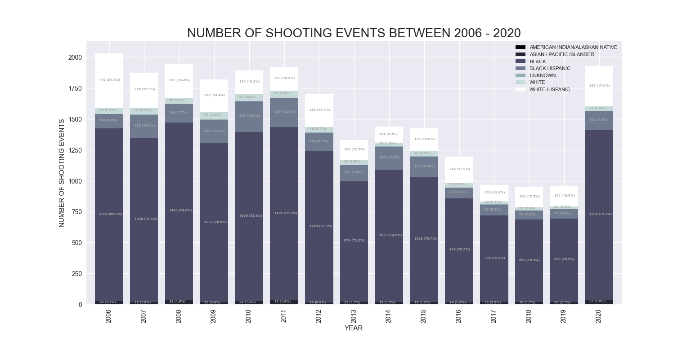
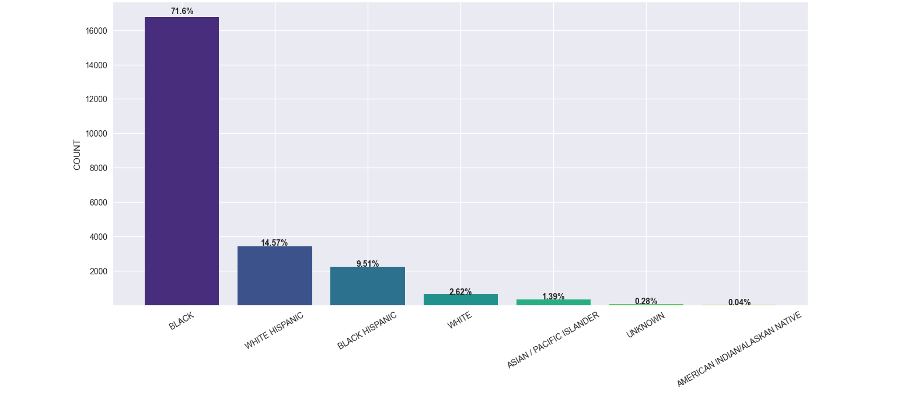
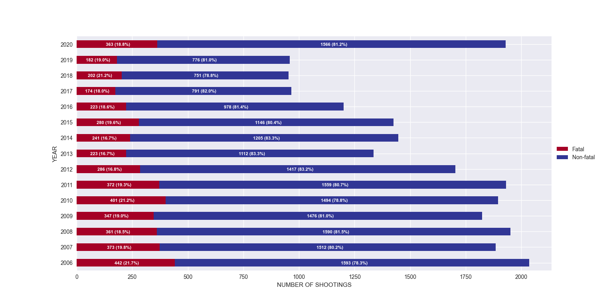
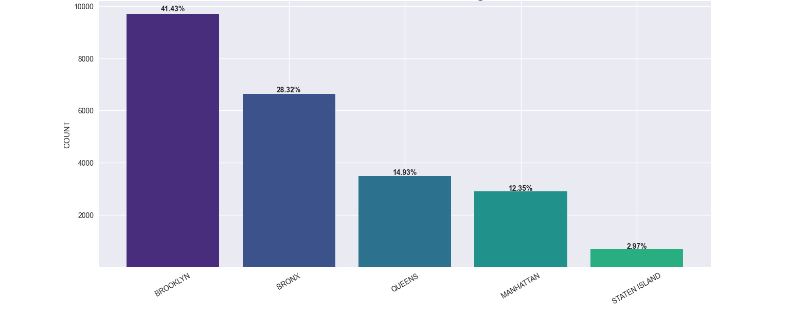
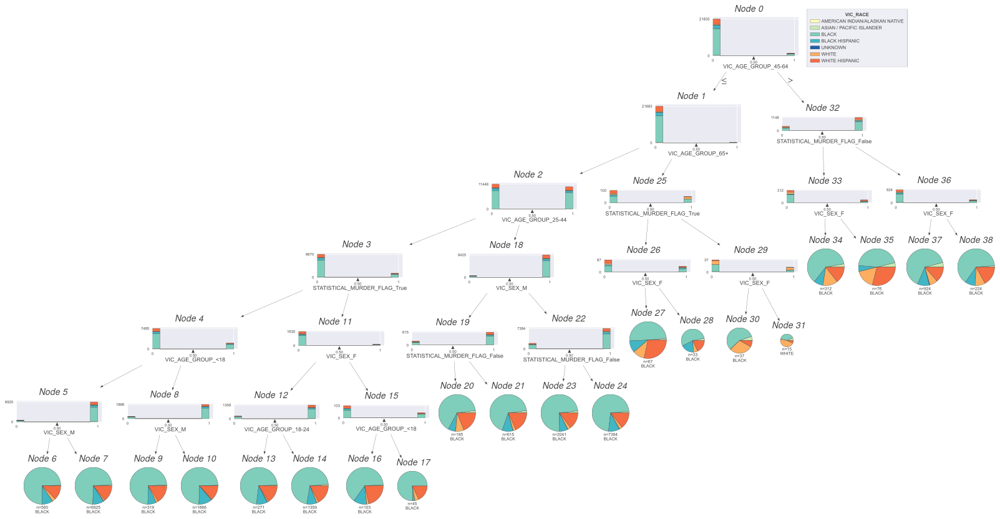

# Data-Science

# Project

Gun violence in NYC

# Introduction:
The article 3 of the universal declaration of human rights states that everyone has the right to life, liberty and the security of person. Neverthless, this fundamental right is threatend by gun violence, a multifaceted problem that affects communities all over the country. This time, we will focus on gun violence in New York City and the victim's race.

# Objective:
As stated before, communities all over the country are being affected by gun violence; however, its impact hits harder to some people than others. The purpose of this project is to visualize the distribution of the categorical variable, victim's race, here in New York.

# Background information:

The used dataset in this project comes from / was obtained from the NYC Open Data website, called NYPD Shooting Incident Data (Historic) that lists every shooting incident occurred in NYC going back to 2006 through the end of year 2020. Each record includes information about the location and time occurrence of the event, and also information related to the suspect and victim demographics. 
In addition, a geojson file that contains the zip code boundary coordinates was obtained from BetaNYC in order to create choroplet map to visualize the number of victims per race in each zip code.

Sources:
NYC Open Data: csv file 
BetaNYC: geoJson file

# Method:
For this project, I created a program in Python that along with some libraries allowed me to manage the data and generate graphs that convey the information contained in the dataset so that it can be better understood.

# Exploratory data analysis

The program cleans and filter the data to generate a stacked bar plot. The following graph shows the behavior of the categorical variable called VIC_RACE, victim's race description, and the amount of victims of a shooting event per race between the years 2006 - 2020. It is noticeable how black people has been disproportionately impacted by gun violence over time.

## Stacked bar plot - Victim's race per year

Additionally, the following two graphs show the percentage of victims per race, and the proportion of the amount of the total shooting events that ended up in a fatality per year, respectively, in the same period of time (2006 - 2020)
 
## Distribution plot - Percentage of victim's race over time

## Stacked bar plot - Fatal and non-fatal events per year

# Cloropleth map
The next figure is a cloropeth map, a type of statistical thematic map that uses the intensisty of colors to be in tune with an aggregate summary of a geographic characteristic. In this case, the geographic characteristic is the number of victims of shooting events. The intensity of color red shows us how the number of victims change from place to place, being the locations in Brooklyn and Bronx the ones where the highest number of shooting events have taken place. Markers have been added to the map to list the number of victims per race in each zip code.

## Cloropeth map - Shooting events in NYC

## Distribution of borough variable
The following figure exhibits the percentage of shooting events per borough.

# Model inference
This dataset is made up of some categorical variables, such as, borough, victim's sex, race, and age group, and latitude and longitude which has been converted to its corresponding zip code. A method to convert the categorical data into indicator variables increases the size of the dataset. Now that we have a larger dataset, we could create a machine learning model that will predict the output of a variable. The categorical variable that will be predicted in this project is called VIC_RACE, victim's race description. The program includes a machine learning library called Scikit-learn that will help us create the machine learning model. Since we are dealing with categorical data, I chose the Decision Tree Classifier. Specific methods split the data into train and test subsets so the model can be evalutated. 
This is a  visualization of the decision tree:
## Decision tree classifier

The program also computes the accuracy score, which is a metric for evaluating the decision tree model. After running the program, it prints out: 

\>\>The accuracy score of the Decision Tree model is:  0.71058

# Conclusion:
The program generates graphs that let the user easily identify which race have been more impacted by gun violence and where the majority of shooting events have taken place.
71.6% of the people, victims of shooting events, are black.
41.43% of the shooting events have taken place in Brooklyn and 28.23% in the Bronx.
The majority of shooting events have taken place in Band the Bronx.
By the intensity of color red, the choroplet map highlights the features of the data. The highest number of victims correspond to the zip code 11212 in Brooklyn, and lists the people affected per race between 2006 and 2020
AMERICAN INDIAN / ALASKAN NATIVE: 0
ASIAN / PACIFIC ISLANDER: 3
BLACK: 1017
BLACK HISPANIC: 45
UNKNOWN: 3
WHITE: 4
WHITE HISPANIC: 39
The accuracy score for the decision tree model is 0.71. It might suggests that the chosen model was not the right one, or the size of the dataset is not adequate for this model.

 and being the location given by the zip code and the victim's race description.

# Resources:
https://towardsdatascience.com/understanding-feature-engineering-part-2-categorical-data-f54324193e63
https://python-visualization.github.io/folium/quickstart.html#Markers
https://deparkes.co.uk/2016/06/24/folium-marker-clusters/
https://www.dataquest.io/blog/how-to-plot-a-bar-graph-matplotlib/
https://analyticsindiamag.com/complete-guide-to-handling-categorical-data-using-scikit-learn/
https://scikit-learn.org/ sklearn.model_selection.train_test_split
https://scikit-learn.org/stable/modules/generated/sklearn.tree.DecisionTreeClassifier.html
https://scikit-learn.org/stable/modules/  sklearn.tree.export_graphviz
https://mljar.com/blog/visualize-decision-tree/

