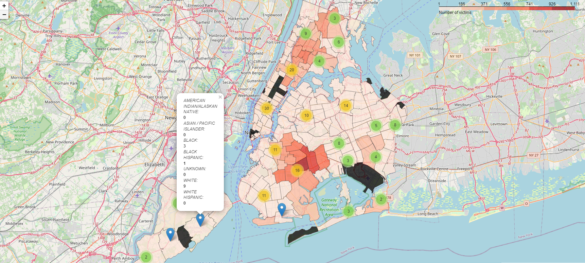

# Data Science Project

<h1 align = "center">
Gun violence in NYC
</h1>

# Introduction:
The article 3 of the universal declaration of human rights states that everyone has the right, liberty and security of person. Neverthless, this fundamental right is threatened by gun violence, a multifaceted problem that affects communities all over the country. This time, we will focus on gun violence in New York City.


# Objective:
As stated before, communities all over the country are being affected by gun violence; however, its impact affects people in different proportions. The purpose of this project is to visualize the distribution of the categorical variable, victim's race, here in New York.

# Background information:

The used dataset in this project was obtained from the NYC Open Data website, called NYPD Shooting Incident Data (Historic) that lists every shooting incident occurred in NYC going back to 2006 through the end of year 2020. Each record includes information about the location and time occurrence of the event, and also information related to the suspect and victim demographics. 
In addition, a geojson file that contains the zip code boundary coordinates was obtained from BetaNYC in order to create choroplet map to visualize the number of victims per race in each zip code.

Datasets sources:
1. NYC Open Data: csv file 
2. BetaNYC: geojson file

# Method:
For this project, I created a program in Python that along with some libraries allowed me to manage the data and generate graphs that convey the information contained in the dataset so that it can be better understood.

```python
import pandas as pd
import numpy as np
import matplotlib.pyplot as plt
import seaborn as sns
import folium
from folium.plugins import MarkerCluster
from geopy.geocoders import Nominatim
import pgeocode
from datetime import datetime
from sklearn.model_selection import train_test_split
from sklearn.tree import DecisionTreeClassifier, DecisionTreeRegressor
from sklearn.metrics import accuracy_score
from sklearn import preprocessing, tree
from dtreeviz.trees import dtreeviz
import graphviz
```

# Exploratory data analysis

The program cleans and filter the data to generate a stacked bar plot. The following graph shows the behavior of the categorical variable called VIC_RACE, victim's race description, and the amount of victims of a shooting event per race between the years 2006 - 2020. It is noticeable how black people has been disproportionately impacted by gun violence over time.

```python
def stacked_bar_plot(df):
    df = df[['YEAR', 'VIC_RACE']]
    fraction_race = pd.crosstab(index=df['YEAR'], columns = df['VIC_RACE'], normalize = "index")
    proportion_race = pd.crosstab(index = df['YEAR'], columns = df['VIC_RACE'])
    plt.style.use("seaborn")
    proportion_race.plot(kind = 'bar', stacked = True, colormap = 'bone', figsize = (10,6), width = 0.8)
    plt.legend(loc = 1, prop={'size' : 8})
    plt.xlabel("YEAR")
    plt.ylabel("NUMBER OF SHOOTING EVENTS")
    plt.title('NUMBER OF SHOOTING EVENTS BETWEEN 2006 - 2020', size = 20)
    for m, n in enumerate([*proportion_race.index.values]):
        for (a, b, c, d) in zip(proportion_race.loc[n], proportion_race.loc[n], proportion_race.loc[n].cumsum(), fraction_race.loc[n]):
            if (d*100 >= 0.8):
                plt.text(x = m-0.28, y = (c-a)+(a/2), s = f'{b} ({np.round(d*100, 1)}%)', color = 'darkgray', fontsize = 6, fontweight = "bold")

    plt.show()
```


<h4 align = "center"> Fig. 1 - Stacked bar plot - Victim's race per year</h4>


Additionally, the following two graphs show the percentage of victims per race, and the proportion of the amount of the total shooting events that ended up in a fatality per year, respectively, in the same period of time (2006 - 2020)
 
<br><br/>


<h4 align = "center"> Fig. 2 - Distribution plot.  Percentage of victim's race between 2006 - 2000.</h4>


<br><br/>

<h4 align = "center"> Fig. 3 - Stacked bar plot. Fatal and non-fatal events per year.</h4>
<br><br/>

# Cloropleth map
The next figure is a cloropeth map, a type of statistical thematic map that uses the intensisty of colors to be in tune with an aggregate summary of a geographic characteristic. In this case, the geographic characteristic is the number of victims of shooting events. The intensity of color red shows us how the number of victims change from place to place, being the locations in Brooklyn and Bronx the ones where the highest number of shooting events have taken place. Markers have been added to the map to list the number of victims per race in each zip code.

```python
def generate_choropleth_map(df, n_df, geodata="nyc_.geojson"):
    data_zip_code = df['zipcode'].value_counts().rename_axis('z_code').reset_index(name = 'counts')

    map = folium.Map(location=[40.693943, -73.985880], default_zoom_start = 15)
    map.choropleth(geo_data = geodata, data = data_zip_code, columns = ['z_code','counts'], key_on = 'feature.properties.postalCode', fill_color = 'Reds', fill_opacity = 0.75, line_opacity = 0.3, legend_name = 'Number of victims')

    lat = n_df['LAT'].tolist()
    lng = n_df['LNG'].tolist()
    am_in_race = n_df['AMERICAN INDIAN/ALASKAN NATIVE'].tolist()
    as_pa_race = n_df['ASIAN / PACIFIC ISLANDER'].tolist()
    b_race = n_df['BLACK'].tolist()
    b_h_race = n_df['BLACK HISPANIC'].tolist()
    un_race = n_df['UNKNOWN'].tolist()
    wh_race = n_df['WHITE'].tolist()
    wh_h_race = n_df['WHITE HISPANIC'].tolist()
    z_code = n_df['zipcode'].tolist()
    
    m_cluster = MarkerCluster().add_to(map)

    for i in range(len(lat)):
        location = [lat[i], lng[i]]
        tooltip = "Zip code: {}<br> Click for more".format(z_code[i])

        folium.Marker(location, popup="""
                    <i>AMERICAN INDIAN/ALASKAN NATIVE: </i> <br>  <b>{}</b> <br>
                    <i>ASIAN / PACIFIC ISLANDER: </i> <br>  <b>{}</b> <br>
                    <i>BLACK: </i> <br>  <b>{}</b> <br>
                    <i>BLACK HISPANIC: </i> <br>  <b>{}</b> <br>
                    <i>UNKNOWN: </i> <br>  <b>{}</b> <br>
                    <i>WHITE: </i> <br>  <b>{}</b> <br>
                    <i>WHITE HISPANIC: </i> <br>  <b>{}</b> <br>""".format(
                        am_in_race[i],
                        as_pa_race[i],
                        b_race[i],
                        b_h_race[i],
                        un_race[i],
                        wh_race[i],
                        wh_h_race[i]),
                        tooltip=tooltip).add_to(m_cluster)
                 
    map.save('my_map.html')
```



<h4 align = "center"> Fig. 4 - Choropleth map. Shooting events in NYC.</h4>


Click on the [link](https://adiezag.github.io/Data-Science/doc/my_map.html) to see the interactive choropleth map.


The following figure exhibits the percentage of shooting events per borough.

<br></br>


<h4 align = "center"> Fig. 5 - Distribution of BOROUGH variable.</h4>

<br></br>

# Model inference
This dataset is made up of some categorical variables, such as, borough, victim's sex, race, and age group, and latitude and longitude which has been converted to its corresponding zip code. A method to convert the categorical data into indicator variables increases the size of the dataset. Now that we have a larger dataset, we could create a machine learning model that will predict the output of a variable. The categorical variable that will be predicted in this project is called VIC_RACE, victim's race description. The program includes a machine learning library called Scikit-learn that will help us create the machine learning model. Since we are dealing with categorical data, I chose the Decision Tree Classifier. Specific methods split the data into train and test subsets so the model can be evalutated. 
This is a  visualization of the decision tree:

``` python
def dtreeviz_visualization(dataframe):
    column_names = ['STATISTICAL_MURDER_FLAG_False', 'STATISTICAL_MURDER_FLAG_True','VIC_AGE_GROUP_18-24','VIC_AGE_GROUP_25-44',
                    'VIC_AGE_GROUP_45-64','VIC_AGE_GROUP_65+', 'VIC_AGE_GROUP_<18', 'VIC_SEX_F', 'VIC_SEX_M']
    
    dataframe = dataframe.drop(columns = 'zipcode')
    encoder = preprocessing.LabelEncoder()
    encoder.fit(dataframe['VIC_RACE'])
    dataframe['RACE'] = encoder.transform(dataframe['VIC_RACE'])
    model_ = tree.DecisionTreeClassifier()
    model_.fit(dataframe.iloc[:,1:10], dataframe['RACE'])
    d_tree_viz = dtreeviz(model_, x_data = dataframe.iloc[:,1:10], y_data = dataframe['RACE'],
                            target_name = 'VIC_RACE', feature_names = column_names, 
                            class_names = list(encoder.classes_), show_node_labels = True)
    d_tree_viz.save('my_tree.svg')
    return d_tree_viz
```


<h4 align = "center"> Fig. 6 - Decision tree.</h4>

The program computes the accuracy score, which is a metric for evaluating the decision tree model. 

```python
def decision_tree_model(X_train, X_test, y_train, y_test):
    model = DecisionTreeClassifier()
    model.fit(X_train, y_train)
    predictions = model.predict(X_test)
    score = accuracy_score(y_test, predictions)
    return score, model
```

After running the program, the computed score variable is:

\>\>The accuracy score of the Decision Tree model is:  0.71058

# Conclusion:
1. The program generates graphs that let the user easily identify which race have been more impacted by gun violence and where the majority of shooting events have taken place.
2. 71.6% of the people, victims of shooting events, are black.
3. 41.43% of the shooting events have taken place in Brooklyn and 28.23% in the Bronx.
4. The majority of shooting events have taken place in Band the Bronx.
5. By the intensity of color red, the choroplet map highlights the features of the data. The highest number of victims correspond to the zip code 11212 in Brooklyn, and lists the people affected per race between 2006 and 2020
    - AMERICAN INDIAN / ALASKAN NATIVE: 0
    - ASIAN / PACIFIC ISLANDER: 3
    - BLACK: 1017
    - BLACK HISPANIC: 45
    - UNKNOWN: 3
    - WHITE: 4
    - WHITE HISPANIC: 39
6. The accuracy score for the decision tree model is 0.71. It might suggests that the chosen model was not the right one, or the size of the dataset is not adequate for this model.

# Resources:
- https://towardsdatascience.com/understanding-feature-engineering-part-2-categorical-data-f54324193e63
- https://python-visualization.github.io/folium/quickstart.html#Markers
- https://deparkes.co.uk/2016/06/24/folium-marker-clusters/
- https://www.dataquest.io/blog/how-to-plot-a-bar-graph-matplotlib/
- https://analyticsindiamag.com/complete-guide-to-handling-categorical-data-using-scikit-learn/
- https://scikit-learn.org/     sklearn.model_selection.train_test_split
- https://scikit-learn.org/stable/modules/generated/sklearn.tree.DecisionTreeClassifier.html
- https://scikit-learn.org/stable/modules/      sklearn.tree.export_graphviz
- https://mljar.com/blog/visualize-decision-tree/